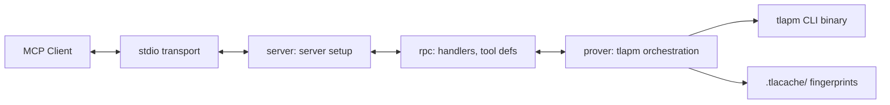

# Preface

This is the index file for the `internal/` directory's knowledge base. It provides context about the core internal packages of tlapm-mcp.

Read the top-level `.kb/agents.md` file before continuing below.

# Overview

The `internal/` directory houses the core business logic of tlapm-mcp. It coordinates MCP server setup, tool handler registration, and TLA⁺ proof orchestration. These packages are not part of tlapm-mcp's public API and are consumed only by the entry point and tests.

# Architecture

The tlapm-mcp pipeline is coordinated by the `server` package:

# Directory

- `server/` - MCP server setup: creates server instance, registers tools, manages the prover.
- `rpc/` - Tool handlers, tool definitions, and argument parsing for all MCP tools.
- `prover/` - Core TLA⁺ prover logic: tlapm invocation, output parsing, step parsing, fingerprinting, and DFS range resolution.

# Documents

- `server/AGENTS.md` - MCP server setup details.
- `rpc/AGENTS.md` - Tool handlers and definitions details.
- `prover/AGENTS.md` - TLA⁺ prover orchestration details.

